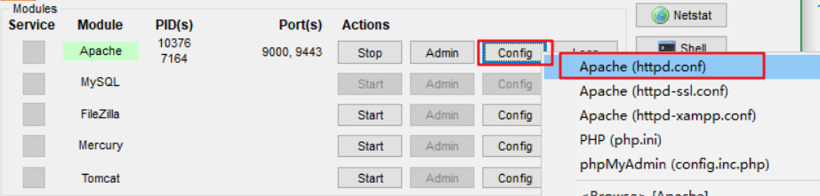
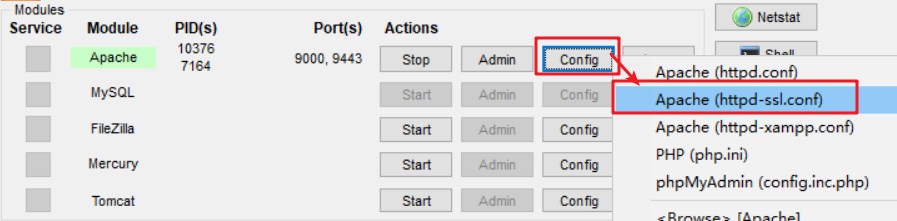
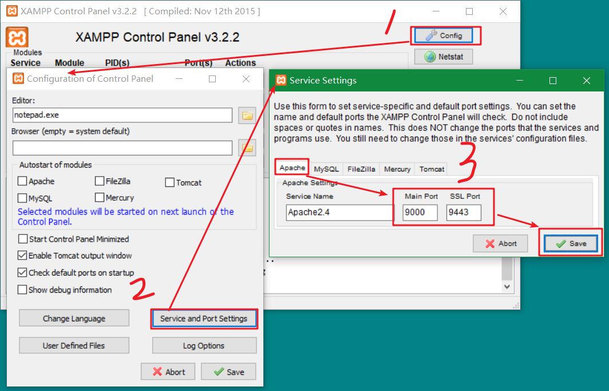
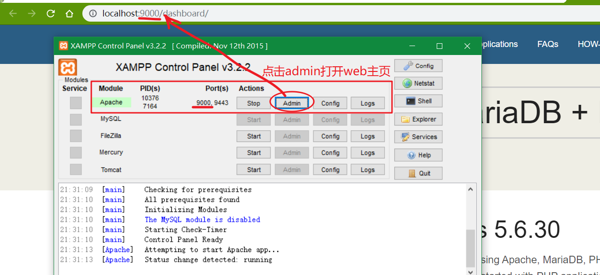
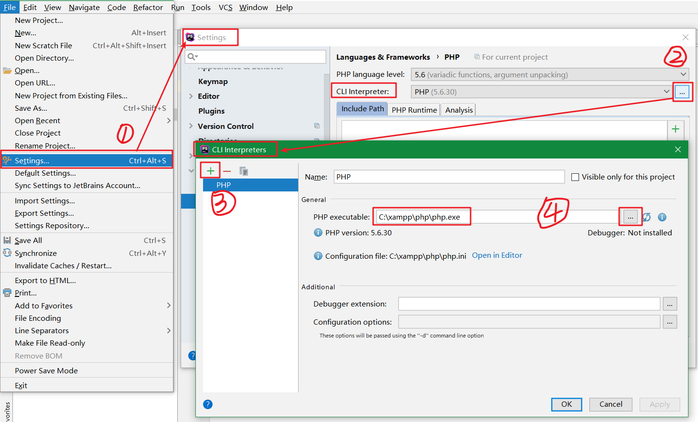
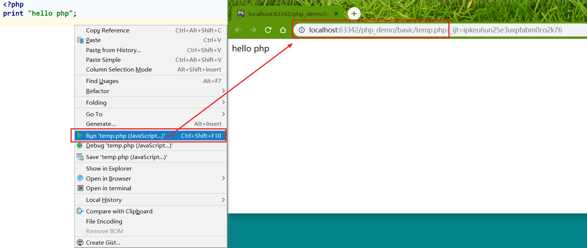
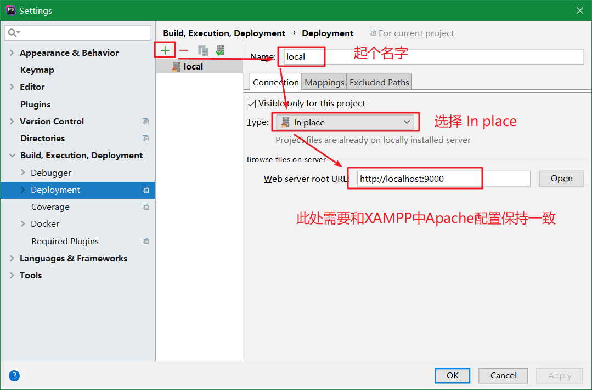
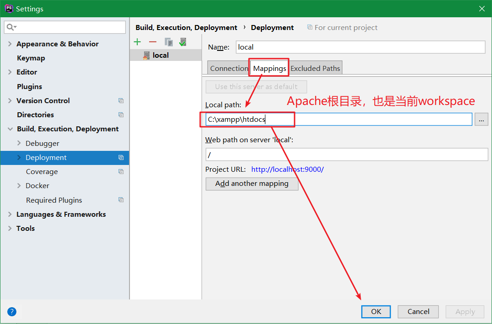
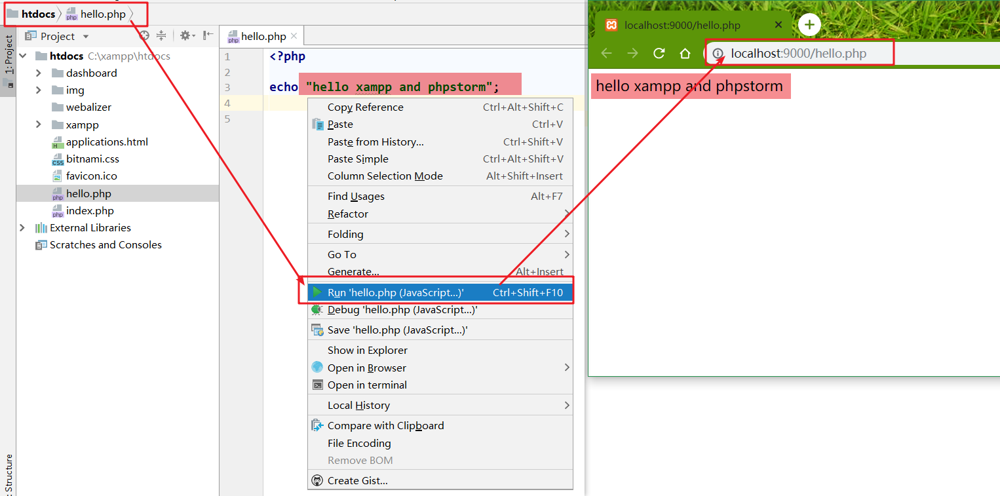

# php
PHP（全称：PHP：Hypertext Preprocessor，即"PHP：超文本预处理器"）是一种通用开源脚本语言。

PHP 是一种创建动态交互性站点的强有力的服务器端脚本语言。

## 安装
官方 PHP 网站（PHP.net）有 PHP 的安装说明： http://php.net/manual/en/install.php

## WampServer
对于初学者建议使用集成的服务器组件，它已经包含了 PHP、Apache、Mysql 等服务,免去了开发人员将时间花费在繁琐的配置环境过程。

## XAMPP
XAMPP 支持 Mac OS 和 Windows 系统，下载地址：https://www.apachefriends.org/zh_cn/index.html。

### Apache
Apache是世界使用排名第一的Web服务器软件。

也是XAMPP中最重要的一个软件，在XAMPP中经常会因为端口占用的问题，而需要修改端口号。



修改【httpd.conf】配置文件，修改其中Listen监听端口配置：
```shell
#Listen 12.34.56.78:80
Listen 9000
```

除了web监听端口的修改，SSL端口默认为443也有可能被占用，修改【httpd-ssl.conf】中监听端口：



```shell
#
# When we also provide SSL we have to listen to the 
# standard HTTP port (see above) and to the HTTPS port
#
Listen 9443
```

为了方便通过XAMPP control panel打开web主页，可以进一步【config】：



然后可以通过【admin】按钮直接打开web页面，如下所示：



### MySql
XAMPP中也包含了MySql软件，如果已经单独安装过MySql服务，则不需要在安装XAMPP时勾选MySql组件，否则会因为服务冲突导致，安装失败。

单独安装Mysql也是可以的。

## IDE
### PhpStorm（收费）

PhpStorm 是一个轻量级且便捷的PHP IDE，其旨在提供用户效率，可深刻理解用户的编码，提供智能代码补全，快速导航以及即时错误检查。

PhpStorm 非常适合于PHP开发人员及前端工程师。提供诸于：智能HTML/CSS/JavaScript/PHP编辑、代码质量分析、版本控制集成（SVN、GIT）、调试和测试等功能。

https://www.jetbrains.com/phpstorm/

https://confluence.jetbrains.com/display/PhpStorm/Previous+PhpStorm+Releases

**破解**

http://idea.lanyus.com/

复制注册码即可


### PhpStorm interpreter解释器配置
安装phpstorm后，还需要解释器的配置，否则phpstorm无法识别php开发环境。

【settings】-【language&Framework】-【PHP】

在interpreter中添加php.exe配置，此处基于XAMPP，设置默认【C:\xampp\php\php.exe】路径即可。



选中文件，右键执行【run ....】命名



即可打开默认浏览器，显示该php文件。

### phpstorm xampp
结合phpstorm和xampp开发，通常会将xampp中【htdoc】文件夹作为workspace进行开发，需要设置如下：

【settings】-【build，execution，deployment】-【Deployment】

先配置connection，需要和XAMPP中Apache链接端口保持一致：



再配置mapping映射，需要和Apache的根目录【htdocs】保持一致：



完成配置后，在phpstorm中运行php文件，就会是Apache中配置的端口，而非phpstorm的临时端口


